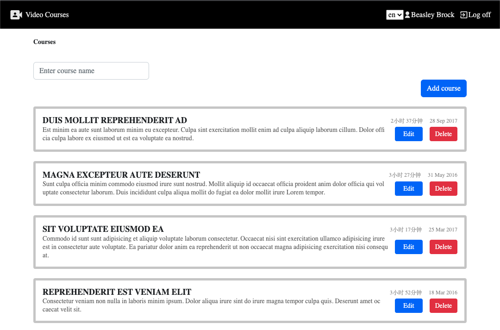

# Angular Video Course Project



This is a video course management application built using Angular. The application allows users to manage video courses through the following features:

- Video course listing
- Adding a new course
-Editing a course
- Deleting a course
- Logging in and out of the application


## Technical Features

The application incorporates a range of technical features and best practices, including:

- Token validation and route protection: The auth.guard.ts is used to verify user tokens and protect sensitive routes from unauthorized access.
- Unit testing: The application includes a comprehensive suite of unit tests to ensure high code quality and functionality.
- Custom directives and pipes: The use of custom directives and pipes allows for improved code organization, reuse, and readability.
- Third-party module integration: The application is integrated with various third-party modules to provide enhanced functionality and user experience.
- Dynamic module loading: Dynamic module loading is utilized to improve the application's performance by loading only the required modules when needed.
- Routing: The application leverages Angular's powerful routing system to provide smooth and intuitive navigation.
- Http requests: The use of Http requests enables the application to interact with external APIs and data sources.
- Rxjs: The use of Rxjs enables the application to efficiently manage asynchronous data streams and state.
Ngrx integration: The integration with Ngrx provides a powerful and scalable state management solution.
- Form handling and custom form components: The application utilizes Angular's built-in form handling capabilities and custom form components to provide users with a smooth and intuitive interface for creating and editing video courses.
- Internationalization: The application uses the Ng Translate library to support internationalization and localization.
- Server-side rendering (SSR) implementation: The application is built with server-side rendering to enhance performance and provide a better user experience.


## Installation
To run the application, follow these steps:

- Clone the repository to your local machine.
- Install the necessary dependencies using npm install.
- Run the application using npm start.
- Access the application in your web browser at http://localhost:4200.
- Enter `server` direction, execute `yarn start` to start serve

## Testing
To run the tests for the application, use the following command:
```
npm test
```
This will run all unit tests for the application.
